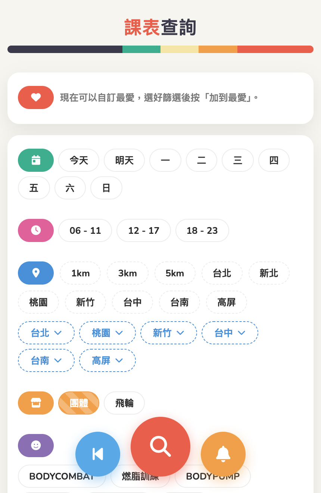

# 🏋️ World Gym 課表查詢

查詢 World Gym 台灣各分店團體課表的網站,前端是純靜態頁面,後端用 Cloudflare Worker + D1 資料庫。



線上版本:
- Hosting: https://worldgym.pages.dev
- API: https://worldgym-api.lions2100.workers.dev

## 🏗️ 架構

```
.
├── index.html / script.js / style.css   # 前端:課表查詢頁(含首頁廣告輪播)
├── manifest.json / sw.js / icons/       # PWA 設定與 Service Worker(推播提醒用)
├── admin.html / admin.js                # 後台:手動觸發重抓、查看爬蟲紀錄、報表(Chart.js 畫圖)
├── vendor/chart.umd.min.js              # Chart.js(vendor 進來,不吃 CDN,admin.html 報表用)
├── branches.json                        # 分店清單快取(前端用)
├── functions/_middleware.js             # Cloudflare Pages Functions:只放行台灣 IP
├── _headers                             # 靜態資源快取設定(style.css/icons 走長效快取,script.js 開發中暫不快取)
├── hosting/                             # Cloudflare Workers 靜態託管設定(wrangler)
└── worker/                              # Cloudflare Worker API
    ├── src/index.js                     # 路由 / CORS / 入口 / cron scheduled()
    ├── src/queryClasses.js              # 課表查詢邏輯
    ├── src/scrape.js                    # 爬蟲邏輯(重抓官網課表寫入 D1)
    ├── src/reminders.js                 # 課前推播提醒:登記/取消/到期後發送 Web Push
    ├── src/branches-seed.js             # 分店清單固定資料(slug 對應官網 find-a-club/{slug})
    ├── schema.sql                       # D1 完整 schema(含預設種子資料),重建資料庫時整份下
    └── migrations/                      # 針對既有正式資料庫的單張 table migration(不動其他表)
```

前端呼叫 `worker/` 部署出來的 API(`/queryClasses` 等端點),API 讀寫 Cloudflare D1(`worldgym-schedule` 資料庫)。`worker/wrangler.toml` 裡的 `[triggers]` cron 有三個:`*/5 * * * *` 每 5 分鐘掃描是否有課前推播提醒到期,跟爬蟲無關;`0 19 * * *`、`0 9 * * *` 是台灣時間 03:00、17:00 各自動重抓一次全部分店(需要 Workers Paid 方案,單次執行 subrequest 上限 1000,才跑得完 104 家分店)。也可以透過 `admin.html` 手動觸發重抓。

前端另外有埋 GA4 事件(篩選、查詢、登記/取消提醒等),用來看使用行為。

## 🗄️ 資料表總覽

D1(`worldgym-schedule`)裡的 table,完整欄位定義以 [`worker/schema.sql`](worker/schema.sql) 為準:

| Table | 用途 |
| --- | --- |
| `classes` | 爬蟲抓下來的課表(分店、日期、課程、老師、教室等) |
| `branches` | 分店清單(slug、名稱、地區) |
| `meta_filter_options` | 篩選用的課程名稱/老師名稱清單快取 |
| `reminders` | 課前推播提醒的登記紀錄與發送狀態 |
| `ads` | 首頁廣告輪播內容與上下架時間 |
| `ad_events` | 廣告曝光/點擊打點(admin.html 廣告報表用) |
| `teacher_search_events` / `course_search_events` / `branch_search_events` | 老師/課程/分店的查詢次數打點(admin.html 排行榜報表用) |
| `search_events` | 整體查詢次數與查詢結果數打點(admin.html 查詢趨勢報表用) |
| `favorite_events` | 「我的最愛」建立/使用打點,用匿名 `clientId` 估算人數(admin.html 最愛報表用) |

## 🔔 推播提醒(PWA)

課表查詢頁需要先加到主畫面成為 PWA 才能顯示鈴鐺按鈕(見 `script.js` 的 `isPWAInstalled()`,判斷 `display-mode: standalone`)。使用者對某堂課按鈴鐺登記提醒後:

1. 前端透過 `sw.js` 註冊 Service Worker 並跟瀏覽器要 Push 訂閱(`ensurePushSubscription`),連同上課資訊一起打 `worker` 的 `/registerReminder` 存進 D1。
2. `worker` 的 cron(`src/index.js` 的 `scheduled()`)每 5 分鐘掃一次 D1,找出快到上課時間、還沒發送的提醒。
3. 到期的提醒由 `worker/src/reminders.js` 組出推播內容(標題:`課程名 老師`,內文:`分店 週幾 時間`),用 VAPID 金鑰(`VAPID_SUBJECT` / `VAPID_PUBLIC_KEY` / `VAPID_PRIVATE_KEY`)簽署後送給瀏覽器的 Push 服務。
4. 瀏覽器收到後交給 `sw.js` 的 `push` 事件處理,呼叫 `showNotification` 顯示通知。

本機測試可以在網址加上 `?pwa=1`(等同 `localStorage.setItem("wg_debug_force_pwa","1")`),讓 `isPWAInstalled()` 直接回傳 true,不用真的安裝成 PWA 就能看到鈴鐺按鈕。

## 📢 首頁廣告

首頁上方的廣告輪播內容存在 D1 的 `ads` table(`text` / `url` / `startAt` / `endAt` / `enabled` / `sortOrder`),前端載入時打 `worker` 的 `GET /ads`,只會拿回目前在上下架時間內、且 `enabled = 1` 的廣告;拿不到任何廣告時整條廣告列會自動隱藏。

要臨時下架某則廣告,不用改上下架時間,直接把該筆的 `enabled` 改成 `0` 即可:

```bash
cd worker
npx wrangler d1 execute worldgym-schedule --remote --command="UPDATE ads SET enabled=0 WHERE id='ad-1'"
```

新增/修改 ads table 結構的話,`worker/schema.sql` 是重建整個資料庫用的完整版本(會 `DROP TABLE` 掉所有表,只在建立全新資料庫時執行);要對既有正式資料庫追加改動,改寫或新增 `worker/migrations/` 底下的檔案,用 `wrangler d1 execute ... --remote --file=migrations/xxx.sql` 執行,才不會把 `classes`/`reminders` 等其他表的資料一起清掉。

## 📊 後台報表

`admin.html` 登入後有 6 個報表面板,全部用 [Chart.js](https://www.chartjs.org/)(vendor 進 `vendor/chart.umd.min.js`,不吃 CDN)畫圖:

| 面板 | 資料來源 | 內容 |
| --- | --- | --- |
| 廣告 | `ad_events` | 每則廣告(或全部加總)近 12 個月的曝光/點擊趨勢,可翻頁切換月份視窗 |
| 老師 / 課程 / 分店 | `teacher_search_events` / `course_search_events` / `branch_search_events` | 指定年月的查詢次數排行(前 15 名) |
| 查詢 | `search_events` | 近 12 個月「查詢次數」與「查詢結果數」趨勢(沒結果或結果太多沒顯示也算一次查詢) |
| 最愛 | `favorite_events` | 累積建立人數(用匿名 `clientId` 去重估算)+ 累積使用次數,近 12 個月趨勢 |

網站沒有帳號系統,所以「幾個人」的統計(例如最愛建立人數)是靠前端在 `localStorage` 存一個 `crypto.randomUUID()` 產生的匿名 id(`wg_client_id`),打點時帶著這個 id 送到 worker,後端用 `COUNT(DISTINCT clientId)` 估算——這個 id 不會對應到任何真實身分,純粹統計用。

新增報表面板的話,流程大致是:worker 開一個 `/trackXxx` 打點端點 + 一個 `/xxxStats` 給 admin 讀,新增對應的 D1 table(記得同步寫 migration),前端在對應的使用者動作發生時打 `/trackXxx`,admin.js 用共用的 `createDualLineChart`(雙 Y 軸折線圖)或 `renderRankingBarChart`(排行長條圖)畫出來。

這些統計都不蒐集可識別個人身份的資料,GA4 事件跟這裡的匿名 `clientId` 都只用來看使用量,不會對應到任何真實使用者身分。

## 🛡️ /queryClasses 防濫用

課表查詢是最耗 D1 讀取量的端點，公開給匿名訪客用，沒有登入機制，所以做不到真正的「私有 API」——只能拉高濫用成本，不追求 100% 擋住。兩層防護都在 `worker/src/index.js`：

1. **流量限制**：每 IP 每 60 秒最多 20 次（`/queryClasses`）、10 次（`/issueToken`），用新增的 KV namespace `QUERY_RATE_LIMIT` 記 fixed-window 計數，超過回 `429`。KV 是 eventually-consistent、read-then-write 不是原子操作，這只是「夠用的防濫用」，不是精確計費。
2. **短效 HMAC token**：`GET /issueToken` 發一個 15 分鐘後過期的 token（payload 只有 `exp`，用 `QUERY_TOKEN_SECRET` 簽名，`crypto.subtle.verify` 驗證，不用查資料庫）。`/queryClasses` 沒帶對的 token 回 `401`，body 用 `token_invalid`／`token_expired` 區分是不是單純過期。

前端（`script.js`）對應的邏輯：頁面載入時背景預熱拿一次 token，快取起來；每次查詢帶著 token，如果伺服器說過期，會自動清快取、重新拿一張再重試一次，使用者不會看到任何錯誤畫面（只是可能慢個幾秒）；分頁從背景切回前景時也會順便檢查要不要提前換新，降低真的撞到過期重試的機率。

這套機制擋不住「認真寫爬蟲、會先讀網頁怎麼呼叫 API 再模仿」的人——它的目標只是擋掉隨手直接打 API 的腳本，把濫用成本墊高到「至少要跑一次完整的兩步驟流程」。

## ⚡ 靜態資源快取

`style.css` / `icons/` 走 `_headers` 設定的長效快取(`Cache-Control: max-age=...`),搭配 `index.html`/`admin.html` 裡既有的 `?v=` 版號機制:內容有改的話記得同步更新版號,不然使用者會吃到快取住的舊檔案。`script.js` 因為近期改動較頻繁,暫時從 `_headers` 移除長效快取設定,只靠 `?v=` 版號控制。

圖示改回從 cdnjs 載入完整的 Font Awesome 套件(`https://cdnjs.cloudflare.com/ajax/libs/font-awesome/6.5.2/css/all.min.css`),`fa-` class 可以直接照官方圖示庫用,不用再手動維護子集檔案。

## 🛠️ 本機開發

需要 Node.js 與 [wrangler](https://developers.cloudflare.com/workers/wrangler/)(已在各自的 `package.json` 裡列為 devDependency)。

### 1. 跑前端(靜態頁面)

```bash
cd hosting
npm install
npm run dev
```

會在 `http://localhost:1069` 啟動(Cloudflare Workers 靜態託管模擬)。

### 2. 跑後端 API

```bash
cd worker
npm install
```

在 `worker/` 底下建立 `.dev.vars`(此檔案已被 `.gitignore` 排除,不會進版控):

```
MANUAL_SCRAPE_TOKEN=your-own-secret-token
TEAMS_WEBHOOK_URL=https://your-teams-webhook-url   # 選填,爬蟲失敗時的 Teams 通知
VAPID_PRIVATE_KEY=your-own-vapid-private-key       # 推播提醒用,跟 wrangler.toml 裡的 VAPID_PUBLIC_KEY 成對
QUERY_TOKEN_SECRET=your-own-random-string          # /queryClasses 防濫用用的 token 簽名密鑰,見上方「防濫用」章節
```

你也需要自己在 Cloudflare 建立一個 D1 資料庫跟一個 KV namespace,並把 `worker/wrangler.toml` 裡對應的 `database_id`／`id` 換成你自己的:

```bash
npx wrangler d1 create worldgym-schedule
npx wrangler kv namespace create QUERY_RATE_LIMIT
```

接著啟動本機開發伺服器:

```bash
npm run dev
```

### 3. 部署

```bash
# 部署 API
cd worker && npm run deploy

# 部署前端
cd hosting && npm run deploy
```

`VAPID_PRIVATE_KEY` 跟 `QUERY_TOKEN_SECRET` 都是機密,不放在 `wrangler.toml`,部署前要先設成 Cloudflare Worker 的 secret(只需做一次;`QUERY_TOKEN_SECRET` 沒設定的話,`/queryClasses` 會直接變成 500,記得先設再部署):

```bash
cd worker
npx wrangler secret put VAPID_PRIVATE_KEY
npx wrangler secret put QUERY_TOKEN_SECRET
```

## 📄 授權

[MIT License](LICENSE)
